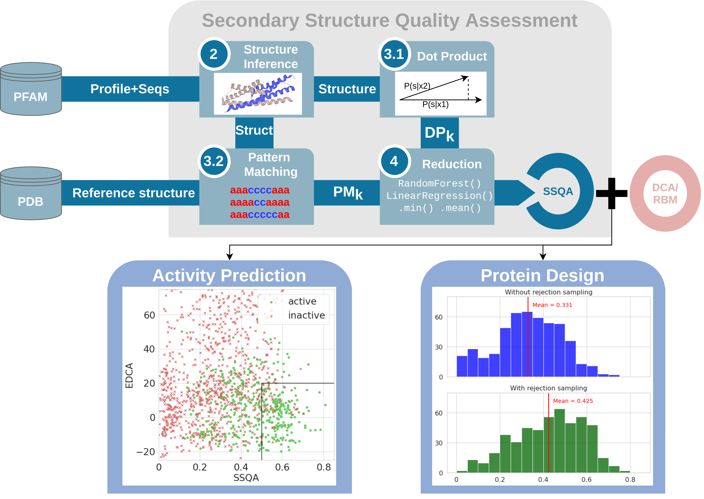

## Improving sequence-based modeling of protein families using secondary structure quality assessment

**Motivation** 
Modeling of protein family sequence distribution from homologous sequence data recently received considerable 
attention, in particular for structure and function predictions, as well as for protein design.  In particular,
Direct Coupling Analysis models drove a lot of attention for their ability to model important correlation in 
protein sequences. Building on these models and other graphical models, we introduce a new framework to assess 
the quality of the secondary structures of the generated sequences with respect to reference structures for 
the family.

**Results**
We introduce two scoring functions characterizing the likeliness of the secondary structure of a protein sequence
to match a reference structure, called Dot Product and Pattern Matching. We test these scores on  published
experimental protein mutagenesis and design dataset, and show improvement in the detection of non-functional
sequences. We also show that use of these scores help rejecting non-functional sequences generated by graphical
models (Restricted Boltzmann Machines) learned from homologous sequence alignments. 

Take a look at our [paper]()

In this repository, we provide :
- Scripts to format data from FASTA file in `data/` as well as all necessary data structure.
- Scripts for performing the diverse Secondary Structure Quality Assessment in `ssqa/` and generative
  algorithms taking into account SSQA in `generation/`
- Implementation of RBM, adaptable to more complex Markov Random Fields model in `pgm/`
- Tutorials and Notebooks to get the results of the paper in `notebooks/`

To use these scripts please install all required Python libraries from `requirements.txt` as well as
[MMSEQS](https://github.com/soedinglab/MMseqs2) and [HH-suite](https://github.com/soedinglab/hh-suite). 
Also, download the working [data]() and add yours easily following the tutorials. Once done, update
the `config.py` with your own absolute path to your data folder to avoid any bug.

### Data Availability

All data are available to download in this [folder](https://idata.phys.ens.fr/index.php/s/LasCHJL54x3rT49) :
- [`cross.zip`](https://idata.phys.ens.fr/index.php/s/5YK2DPjPaPMixJr) for cross references between different databases : Uniprot, Pfam, Pdb
- [`pfam.zip`](https://idata.phys.ens.fr/index.php/s/YqJEz4saHtYEmLQ) for data retrieve on PFAM
- [`mut.zip`](https://idata.phys.ens.fr/index.php/s/5cYxo47yASixFYZ) for data retrieve from Hopf et al. (2017) reformat for the needs of our works
- [`utils.zip`](https://idata.phys.ens.fr/index.php/s/BPfffRccZMBoTXZ) for training and validation set use for secondary structure inference, including own 
  trained weights for NetSurfP2 
  
After downloading is done, extract it and set the path to different data in `config.py`
  
Please, should these links expires, don't hesitate to reach out for us.

### Building Data

Take a look at the tutorial in `notebooks/Tutorials.ipynb`, we detail step by step how to build data. 
You can use the script we provide in `build_data.py`. This will build the data file `data.pt` used for
next uses

### Secondary Structure inference

You can see how to train and validate a secondary structure predictor in `train_ssinf.py`. Some weights 
are provided in [`utils.zip`](https://idata.phys.ens.fr/index.php/s/BPfffRccZMBoTXZ).

### Pattern Matching and Dot Product

Best examples are available in `notebooks/Chorismate Mutases - Russ et al. 2020.ipynb` and 
`notebook/Beta-lactamase Ecoli.ipynb`, detail step by step.

### Sampling with RBM and SSQA

You can refer to `notebook/RBM With SSQA.ipynb` for detailled walktrough on sampling. 
Some pretrained weights for RBM are provided in `pfam/.../weights`.

### Contact

If you have any question please feel free to contact me at [cyril.malbranke@ens.fr](mailto:cyril.malbranke@ens.fr)