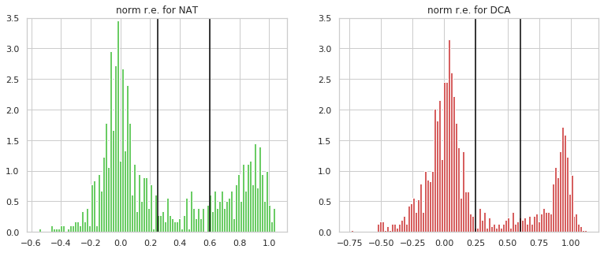
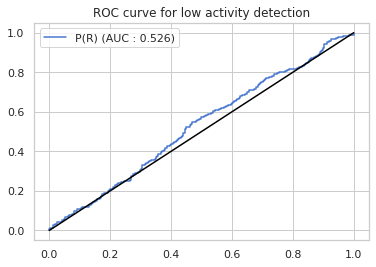
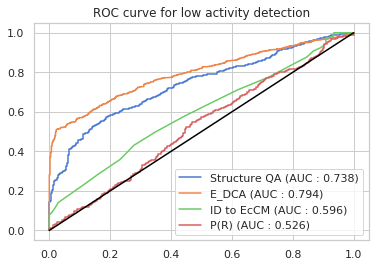
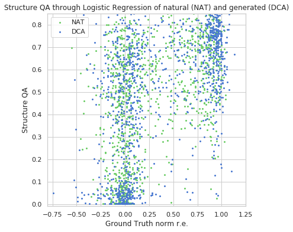
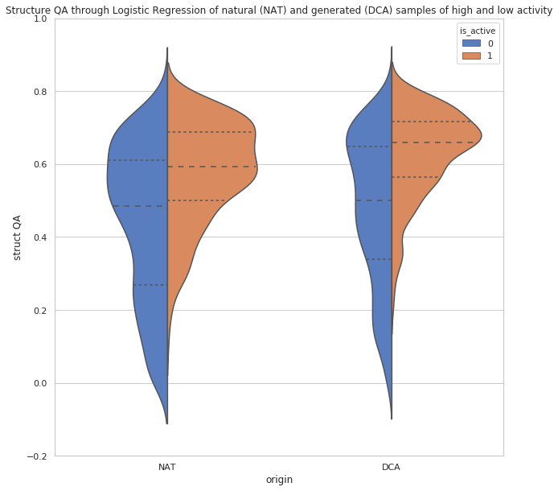
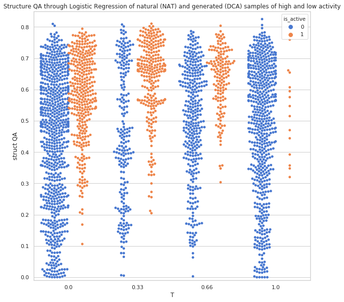
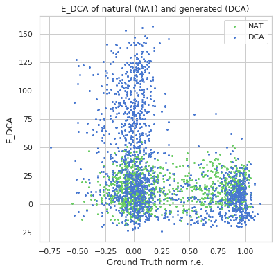
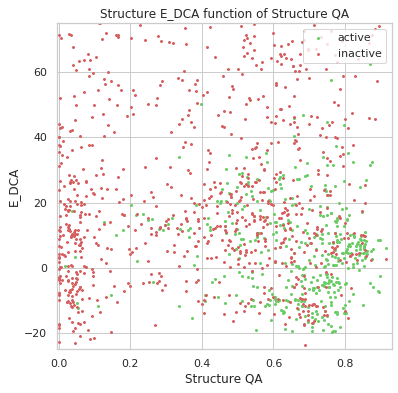

### Introduction

The observation of the data shows that we can separate samples of high activity (data with norm r.e. > 0.6) 
and with low activity(data with norm r.e. < 0.25). There is also intermediary samples that will be use or not, 
given we perform regression or classification tasks.

We identify one main pattern of secondary structure in PdB, and we begin by computing our metric 
$\mathbb{P}(x,R)$ for each natural or generated samples. This metric was not enough to globally separate low activity and high activity patterns.

### Use of the divergence to the EcCM

We then must look at local perturbation of the secondary structure. We consider the distribution of length likelihhod for each piece of structure, and we calculate the divergence of this distribution to the distribution of the reference protein (here EcCM) with this formula :

$$K(x, k) = KL(p_x~||~p_{x_0}) = \sum_{t_k} p(t_{k}|R, x_0) \log{\frac{p(t_{k}|R, x_0) }{p(t_{k}|R, x) }}$$

In our case we have $k=22$ and we perform a logistic regression on this 22-dimension vectors (one for each sample) to try to perform low activity detection from the **simple observation of secondary structure**.

We can compare the metric obtained to 3 other metrics : 
- $\mathbb{P}(x,R)$
- Identity to EcCM : from the paper
- $E_{DCA}$ : from the paper

### Results

We can see that the method perform a better discrimination than simple baseline such as identity to EcCM and give correct results even compare to $E_{DCA}$ that use "more complete" data.

Let's take a look at the graph of the repartition of Secondary Structure Quality Assessment values function of the the activity of the enzyme : 

We can split the graph in 3 zones :
- The top zone : which are samples active or not that have been detected as having a good structure.
- The bottom-left zone : which are sample inactive and have been detected as not having a good structure. These samples could have been "thrown" just by looking at the secondary structure.
- The bottom-right zone : which is less dense than the others and are the samples that have been detected as not having a good structure despite being active. They are the *false positives* of the low activity detection task.

With a cleaner representation we can observe a difference of distribution for low and high activity samples for both natural and generated samples : 

It is also possible to split between the temperatures use for generation and to see the same differences in distribution :

### Comparison with $E_{DCA}$

Let's take a look at the graph of the repartition of $E_{DCA}$ values function of the the activity of the enzyme : 

The detection of low activity samples is far better with this method but only for generated samples so it is linked to the fact that these samples were generated with too much energy. 

If we take a look at the graph of the $E_{DCA}$ in function of the SSQA :

- Bottom-right area : almost all the active samples are in this area that both metrics are good at identifying potentially good samples. 
- Top-right area : samples with high ernergy (mostly inactive) not detected as having a bad structure. Either they have a good secondary structure or their structure was badly assess by the SSQA algorithm.
- Bottom-left area : samples with low energy (mostly inactive) but have been detected by the SSQA as having a bad structure even though the DCA model was unable to identify them as bad examples. These area is therefore the plus value of the SSQA.
