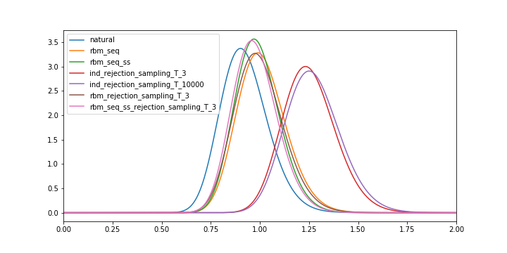
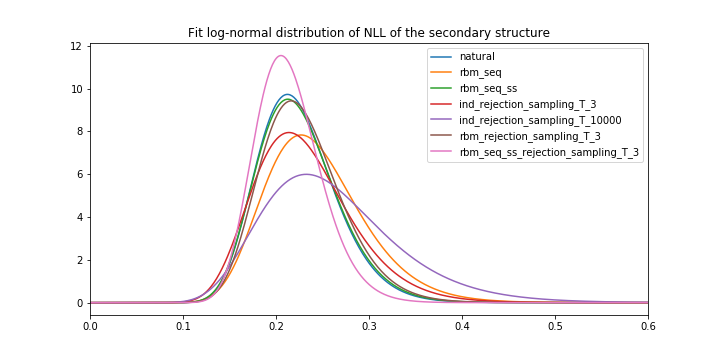
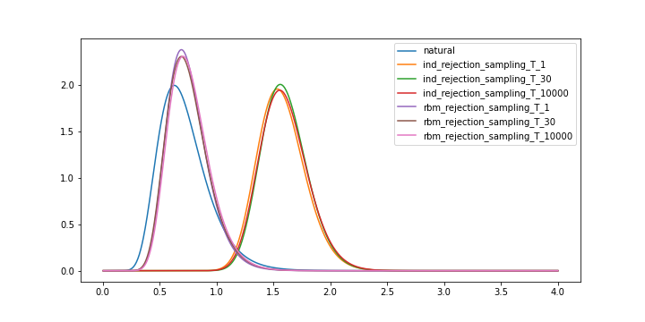
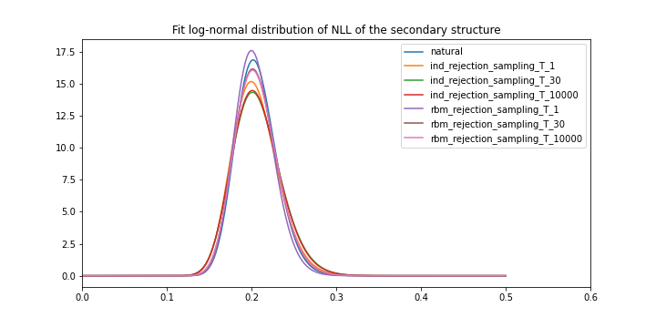

Let $g(x)$ be a function of the statistics of a sequence $x$ and $m(x) = \log M(x)$ where $M(x)$ is the probability of $x$ matching pattern. I focused on finding a way to generated through an energy $E(x) = g(x) + \frac{1}{T} m(x)$

- [x] Use of rejection sampling to simulate $E(x)$
- [x] Implement measures of entropy and diversity
- [x] Perform test of rejection sampling on independant and RBM models

- [x] Make the gradient of $M(x)$ (probability of $x$ matching pattern) computable
- [x] Integrate $M(x)$ in a loss function
- [x] Implementing Maximum Entropy Generator (Deep Generative method)
- [ ] Finding good Neural Networks to put on the MEGs
- [ ] Finding equilibrium between entropy, primary and secondary structure
- [ ] Try learning an Energy Model alonside a Generative Model 
- [ ] Try local metrics computed on Chorismate Mutases

# Generation with secondary structure (WW)

## Measures

For each generative process we are going to measures several metrics.

We want to compare the distribution residue by residue of amino-acids on natural sequences $N_{ind}$ with the one generated by our generatrive process $G$. We then defined :

$$H(G, N_{ind}) = - \mathbb{E}_{X \sim G} \log P_{N_{ind}}(x)$$

We want to compare it to a DCA model too :

$$H(G, N_{DCA}) = - \mathbb{E}_{X \sim G} \log P_{N_{DCA}}(x)$$

And finally we want to assess the diversity of amino-acids at each residue :

$$H(G, G_{IND}) = - \mathbb{E}_{X \sim G} \log P_{G_{IND}}(x)$$

## Rejection sampling 

### Theory

Let's consider an independant model such that $E(x) = \sum_i g_i(x_i) = g(x)$. We want to extend it to include secondary structure QA. We consider $r$ a pattern a $R$ the set of secondary structure matching pattern $r$.
$$M(x) = \sum_{s \in R} \mathbb P(s|x)$$

Then $m(x) = - \log(M(x))$. We can then establish that $E(x) = g(x) + m(x)$. If we want to weight the two value we set $E$ to be $E(x) = g(x) + \frac{1}{T} m(x)$. We then have :

$$\mathbb{P}(x) = \frac{1}{Z} G(x)M(x)^{1/T}$$

How do we sample according to this probability ? Sampling with G(x) is easy but $M(x)$ is not invertible. We rely on rejection sampling.

To do this we sample following to the process :
- We sample $X$ according to $G(x)$ and $U$ according to a unifrom distrbituion in $[0,1]$
- if $M(X)^{1/T} < U$ or $\exp\left(\frac{1}{T}m(x)\right)$ we accept the sample, else we reject the sample and go back to step 1

We then have :
$$\mathbb{P}(X = x) \propto G(x)M(x)^{1/T}$$ which allow us to sample with energy $E(x) = g(x) + \frac{1}{T} m(x)$

We can also do the same with RBM after several steps of gibbs sampling

### Models

**Independant models**

So we generate through an independant model and with rejection some samples and have the following results

**DCA models**

We try to obtan good samples with RBM model by using rejection sampling and simulating the same way an energy of the form :
$$ E(x) = E_{RBM}(x) + \frac{1}{T} m(x) $$

### Results

Visually independant models led too a lot of samples with bad $E_{DCA}$ : 

But in general good structure :

And we have the following metrics : 

| Generator | H(G\, N_ind) | H(G\, N_DCA) | H(G\, G_ind) | SS |
|-----|-----|-----|-----|-----|
| natural | 0.27 | 0.30 | 0.26 | 0.80
| rbm_seq | 0.28 | 0.33 | 0.28 | 0.78
| rbm_seq_ss | 0.27 | 0.32 | 0.27 | 0.80
| ind_rejection_sampling_T_3 | 0.27 | **0.41** | 0.27 | 0.79
| ind_rejection_sampling_T_10000 | 0.28 | **0.42** | 0.28 | 0.77
| rbm_rejection_sampling_T_3 | 0.28 | 0.33 | 0.27 | 0.80
| rbm_seq_ss_rejection_sampling_T_3 | 0.27 | 0.32 | 0.26 | 0.81

## Maximum Entropy Generators

It's harder and harder to lower $T$ because after that all samples get rejected and the model is limited by the limits of the DCA. 

We need to find a better way to generate samples according to these two metrics. For this reason, I tried the Maximum Entropy Generators from [Kumar, Rithesh, et al. (2019)](https://arxiv.org/pdf/1901.08508.pdf)

I tried a first generator as a single dense layer with non-linear activation and a first class of entropy estimators with a bilinear layer.

| Generator | H(G\, N_ind) | H(G\, N_DCA) | H(G\, G_ind) | SS |
|-----|-----|-----|-----|-----|
| natural | 0.27 | 0.30 | 0.26 | 0.80
| rbm_seq | 0.28 | 0.33 | 0.28 | 0.78
| rbm_seq_ss | 0.27 | 0.32 | 0.27 | 0.80
| ind_rejection_sampling_T_3 | 0.27 | **0.41** | 0.27 | 0.79
| ind_rejection_sampling_T_10000 | 0.28 | **0.42** | 0.28 | 0.77
| rbm_rejection_sampling_T_3 | 0.28 | 0.33 | 0.27 | 0.80
| rbm_seq_ss_rejection_sampling_T_3 | 0.27 | 0.32 | 0.26 | **0.81**
| meg_without_matching | 0.50 | 0.31 | 0.17 | 0.64
| meg_with_matching | **0.62** | **0.42** | 0.16 | **0.81**

We take a look at the $E_{DCA}$ :

We take a look at the secondary structures :

